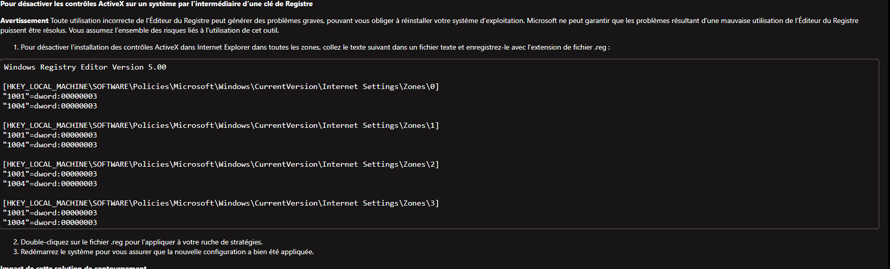

# CVE-2021-40444
Le CVE-2021-40444 est une vulnérabilité zero-day^dont l'exploitation permet d'exécuter un code malveillant à distance sur l'ordinateur victime.
Cette vulnérabilité se trouve dans MSHTML qui est le moteur d'Internet Explorer, même si peux de personne l'utilisent d'autre logiciel dépendent de son moteur comme Microsoft Office, Word ou PowerPoint.

# Comment CVE-2021-40444 est exploiter
Les attaques se présente sous la forme d'un contrôle intégré ActiveX malveillant dans les documents Microsoft Office. Le contrôle permet l'exécution du code arbitraire et les documents sont certainement reçu par email  en pièces jointes, pour pouvoir effectuer cela le cybercriminel doit convaicre la victime d'ouvrir le fichier.

# Comment s'en protéger

Pour évité de télécharger un document Microsoft Office, PowerPoint.. destiné a exécuter du code malveillant il faux interdire l'installation de tout nouveau contrôle ActiveX, ce qui est possible en ajoutant quelques clés au registre du système néamoin 

[voir](https://msrc.microsoft.com/update-guide/vulnerability/CVE-2021-40444) 

# A savoir
 Par défaut, Microsoft Office ouvre les documents provenant d’Internet en mode protégé ou dans Application Guard pour Office, ce qui empêche l’attaque actuelle.

# Source
https://www.kaspersky.fr/blog/cve-2021-40444-vulnerability-mshtml/17575/

https://msrc.microsoft.com/update-guide/vulnerability/CVE-2021-40444